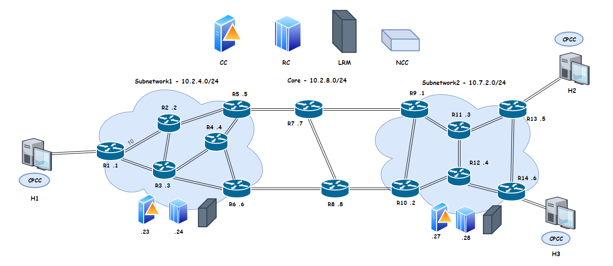

# Network emulator - EON
Optical network emulator with G.8080 (ASON) control plane. This application has been created as a part of TSST course.

This project aimed at showing how **ASON control plane** works within Elastic Optical Network. Hosts can communicate within the network and routes
are automatically reconfigured in case of link malfunction. Application is written in C# language. To our application a python script
has been added which starts the API server for visualization of established paths in our network. In this project only basics of EON were mentioned.

|  |
|:--:|
|*Network topology*|

**1. To run API server use ```run_api.bat```**
**2. To run application use ```run.bat```**  

Application consists of:
- [x] Cable cloud for packet forwarding
- [ ] Nodes (routers)
- [ ] Hosts with Calling party call controller (CPCC)
- [x] Routing controller (RC) with implemented Dijkstra algorithm
- [ ] Network call controller (NCC)
- [x] Link resource manager (LRM)
- [ ] Connection controller (CC)
- [ ] API server

*I was responsible for these two modules checked above*
